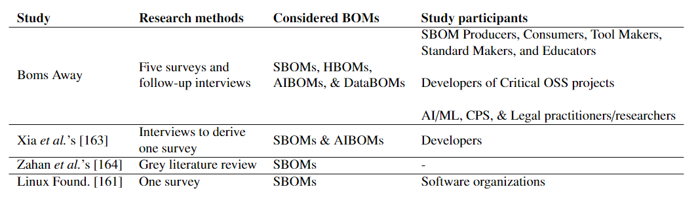
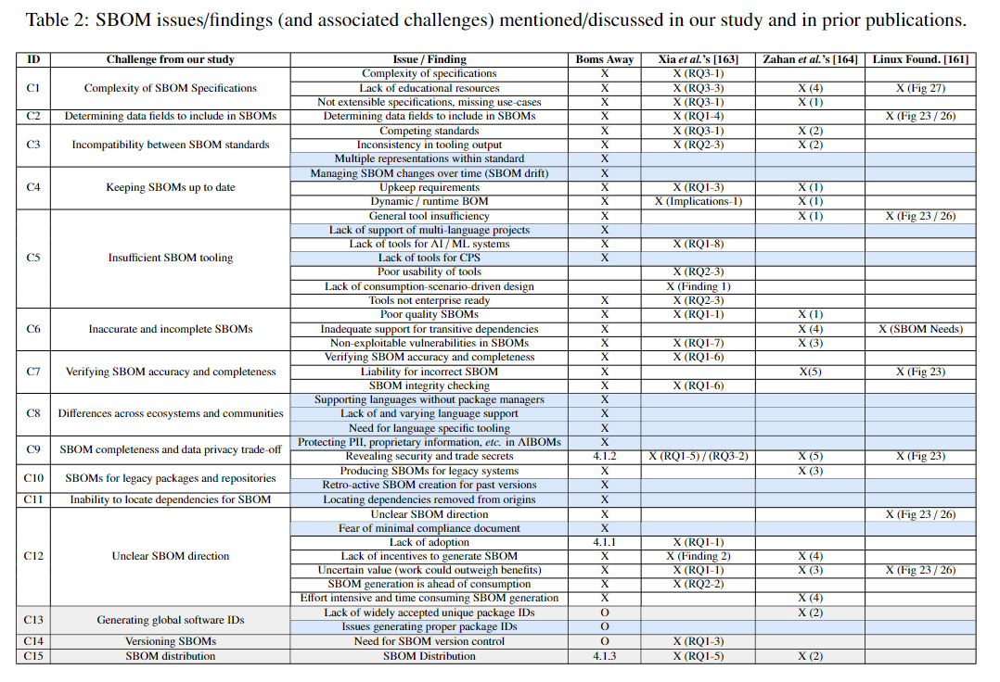
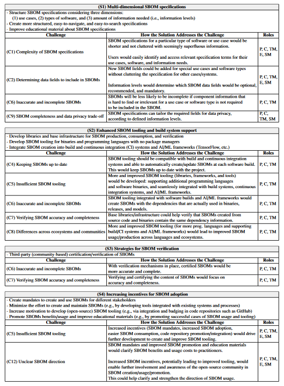
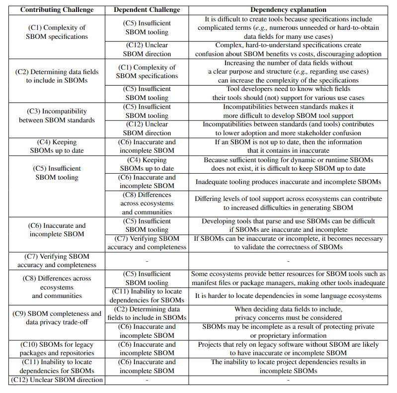
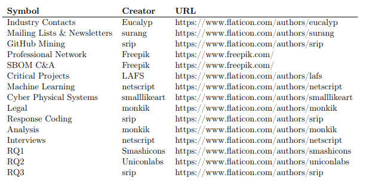

# BOMs Away! Inside the Minds of Stakeholders: A Comprehensive Study of Bills of Materials for Software Systems

All data in this repository has been sanitized and anonymized in accordance with our research protocol.

Link to preprint: https://arxiv.org/pdf/2309.12206.pdf

## Purpose
The contents of this repository serve two purposes.  First, the included data and tools can facilitate the replication and verification of our results.  That is that this repository aims to improve the transparency of our methods.  Second, the included scripts and tools can be adapted by other research teams to be used in their own projects.

### Relevant Badges
- **Available**: We have included our anonymized and sanitized data as well as the entire suite of tools used during analysis.

- **Reusable**: One of the goals of this repository was to create a suite of tools that could be reused and repurposed for similar projects.

## Installation
In order to run the data cleaning and analysis tools, the following libraries will need to be installed.

- `pip install pandas`
- `pip install matplotlib`

## Directory Structure

The `survey_questions` folder contains the questions we asked in the various surveys administered.

The `codes.json` file lists and defines the codes assigned to the responses to open-ended questions. 

The `keywords.json` file provides a list of the keywords used during participant mining for applicable populations.

The `Interview_Protocol.pdf` file describes the process followed during follow-up interviews with participants.

The `image_attribution.PNG` file provides attribution information for the graphics used in the paper.  These attributions are also replicated at the end of this README.

The `additional_content` folder contains supplementary and expanded resources that would not fit cleanly within our paper submission.  These resources are also included at the end of this README.

The `data_analysis` folder contains aggregated survey results and the code used to analyze these results.  **The `data_analysis` directory contains its own README with detailed information on its structure.**

## Data Analysis Tooling

**For detailed descriptions of all of our data analysis functionality, including instructions for adding and analyzing new surveys as well as exploring survey results with our Data Reader, please refer to the README within the `data_analysis` folder.**

### Survey Results

Within the `data_analysis` folder, the `surveys` folder contains directories for each of the five surveys we conducted:
- `initial_survey`
- `key_projects`
- `machine_learning`
- `cyber-physical`
- `legal`

Each parent folder has three nested folders:
- `data`: contains folders with the csv data for responses
- `figs`: contains figures plotting the collected data
- `files`: contains the raw, sanitized JSON files and a file listing valid response IDs

## JSON Structure

To categorize responses to open-ended survey questions, we utilized an *open-coding* approach, in which we defined categories for responses for each question. `codes.json` lists those codes and their definitions for each question, sorted by question "blocks" as defined by the structure of our survey. The structure of `codes.json` is as follows:

```
{
    "Question_Block_Name": {
            "Question1": {
                "Question1Code1": "Code definition...",
                "Question1Code2": "Code definition...",
                ...
            }
            "Question2:" {
                "Question2Code1": "Code definition...",
                ...
            }
        }
    ...
}
```

Part of our approach to gathering participants included mining of publicly-available user data on GitHub using GitHub's API. Specifically, we used this strategy for two surveys, the "SBOM C&A" survey and the "ML" survey. To identify relevant participants, we utilized certain keywords in this search, detailed in `keywords.json`. The structure of this file is as follows:

```
{
    "Survey 1 Name": ["search keyword 1", "search keyword 2", ...],
    "Survey 2 Name: ["search keyword 1", ...]
}
```

## Survey Questions

All survey questions are available in PDF format and can be found in the `survey_questions` folder. The documents were automatically generated by the Qualtrics platform.

Each document consists of a few sections:
- **Survey flow**: this describes the block level logic of the survey.  This includes the logic used to hide or show blocks of questions based on previous responses.  For example, only participants that self-identified as SBOM producers would see questions in the SBOM Producers block.
- **Consent form**: the form that participants were required to sign before continuing
- **Question blocks**: conceptual groupings of similar questions.  The beginning of a block is denoted by `Start of Block: <Block Name>` and a block concludes with `End of Block: <Block Name>`

Question blocks contain the individual questions asked to participants.  Here are some conventions used in the PDF files:
- **Blue block**: a blue block above a question provides the question logic (the condition under which the question will be shown to the survey participant).
- **Asterisk**: an asterisk above a question denotes that an answer is required before the participant can continue.
- **Question ID**: Before the question text, there is a question identifier.  For example, in `S2 Which SBOM format(s) do you use?`, `S2` is the question ID.
- **Dashed lines**: represent the end of a question

### Note on question numbering

For most surveys, the questions are labeled based on the surrounding block and sequentially number based on display order.  This makes discussing and locating the questions much easier.  However, the critical project and CPS surveys were mistakenly published before the questions could be relabeled.  For these cases, the order in which the questions appear in the PDF is also the order they would appear to participants, barring any restrictions in the display logic.

### Individual Survey Details

#### SBOM C&A

`File: sbom_community_adopters_survey.pdf`

Survey Flow:
- Consent Form
- Self-Identification
- Shared Questions (asked to all groups)
- SBOM Producer Questions
- SBOM Consumer Questions
- SBOM Tool Developer Questions
- SBOM Standard Maker Questions
- SBOM Educator Questions
- Security Questions (asked to all groups)
- Demographic Questions (asked to all groups)

#### Critical Projects

`File: critical_projects_survey.pdf`

Survey Flow:
- Consent Form
- Self-Identification
- Shared Questions (asked to all groups)
- Familiar Shared Questions (asked to groups familiar with SBOM)
- Non-User Shared Questions (asked to all non-users)
- SBOM Producer Questions (asked to all producers)
- Internal Producer Questions (asked only to internal producers)
- External Producer Question (asked only to external producers)
- SBOM Consumer Questions
- Familiar Non-User Questions (asked to those familiar with but not using SBOM)
- OBOM Questions
- Demographic Questions

#### Machine Learning

`File: ml_survey.pdf`

Survey Flow:
- Consent Form
- Questions About SBOM Background
- AIBOM Questions
- DataBOM Questions
- Questions About Challenges
- Demographic Questions

#### Cyber Physical Systems

`File: cps_survey.pdf`

Survey Flow:
- Consent Form
- General Cyber-Physical Questions
- SBOM Background
- HBOM Background
- Likert Scale Questions
- Open-ended Questions
- Demographic Questions

#### Legal

`File: legal_survey.pdf`

Survey Flow:
- Consent Form
- Questions About Definition of SBOM
- General Legal Questions
- AI Specific Questions
- Demographic Questions

## Additional Content

PNGs of this content can also be found in the `additional_content` folder.

### Survey participation requests

| Survey            | Mined | Professional Contact | Total |
|-------------------|-------|----------------------|-------|
| SBOM C&A          | 2253  | 0                    | 2253  |
| Critical Projects | 901   | 0                    | 901   |
| ML                | 1269  | 41                   | 1310  |
| CPS               | 0     | 10                   | 10    |
| Legal             | 0     | 2                    | 2     |
| Total             | 4423  | 53                   | 4476  |

### Full Related Works Comparison

#### SBOM study methodology and scope

 

#### SBOM issues/findings coverage by study

| Study          | Discussed Issues/Findings | Coverage | Novel Issues/Findings |
|----------------|---------------------------|----------|-----------------------|
| Boms Away      | 37                        | 88.1%    | 11                    |
| Xia et al.'s   | 23                        | 54.8%    | 3                     |
| Zahan et al.'s | 18                        | 42.9%    | 1                     |
| Linux Found.   | 8                         | 19.1%    | 0                     |
| Total          | 42                        | -        | -                     |


#### Comparison  of challenges across papers



### How Solutions Address Challenges

                                                                
### Challenge Dependenies


### Additional Section Drafts

Here we reproduce draft sections that were omitted from the submitted manuscript due to space limitations. Versions of these can also be found in [this Master's Thesis](https://search.proquest.com/openview/c447e9525d3d208e3b525971996f2067/1?pq-origsite=gscholar&cbl=18750&diss=y).

#### Challenges

**(C13) Generating global software IDs.** To make SBOMs actionable,  their dependencies must have globally unique identifiers and name collisions must be handled properly.  One interviewee mentioned: "If you're on the receiving end and trying to make sense, or trying to aggregate and combine the data from this different source, you're going to need some kind of identifier."

When asked about generating globally unique IDs, One standard maker described generating globally unique software IDs as "our hardest problem to solve."

This is further motivated in that 30\% of SBOM practitioners listed software identifiers as a required SBOM field.  For comparison, that is only slightly less than the 32\% that listed dependencies as a must.  For both AI and Data BOMs, 50\% of ML practitioners, mostly unfamiliar with SBOM, selected unique identifiers as must-have fields. 

Due to the dynamic nature of security vulnerabilities, respondents also mentioned that SBOM should link to external vulnerability databases (\eg the CVE) rather than describing vulnerabilities.  Globally unique IDs are essential for this mapping to be effective.

Respondents also mentioned the importance of having an accessible algorithm to transparently generate a software ID instead of using arbitrary IDs. While solutions in different standards exist, they are not yet interoperable.

**(C14) Managing SBOM versions.** SBOMs should have unique version identifiers just like the software that they represent.  These SBOM versions are not inherently tied to changes in the underlying software however, but instead to changes made to the SBOM document itself.  Given that current tooling often misses or inaccurately fills certain fields, it is sometimes necessary to manually and retroactively correct an SBOM.  At this point, there are two SBOMs, nearly identical, that represent the same build.  It becomes crucial to have mechanisms to properly and appropriately maintain and manage these SBOM versions.  One interviewee described the problem: "In theory, you generate a new globally unique ID every time you produce an SBOM.  What I find in practice is most people don't do that. [...]  According to the spec, it's supposed to be absolutely unique.  You change one character in that SBOM, you should change the globally unique ID for that."  Without these globally unique identifiers it can become challenging for clients to determine which version of an SBOM they have on file.

#### Solutions

**(S5) Improving documentation.** Our results show that, while documentation and educational resources exist for SBOM, they are not sufficient to address the current complexity of the specifications. One interviewee explained, "It's not just simplicity in the spec. It's not simplicity in the tooling, but how we message it and how we communicate it. Because if we send them to the [standard] spec website, they'll take a look at that and go, well, I'm not going through all that work."

The documentation for specification should be designed with end users in mind.  The number of potential use cases and their associated fields make the specifications daunting (C1).  One interviewee explained that, "[...] if all you care about is security, you know, you can look that up very, very quickly and not be bothered by having to learn all these extraneous things that don't have anything to do with your use case."

Better marketing and more effective communication about SBOMs is required.
Effort needs to be invested in distinguishing  SBOMs from other dependency-tracking systems and quasi-SBOMs, or making it clear how these can technologies can interoperate.  With recent advances in large language models, it is also possible to create a system that provides clear, inter-active, and more user-friendly specifications. Such a system could be used to retrieve facts about a specification on demand and provide SBOM examples for different usage scenarios and contexts. 

 Improved documentation and educational resources is likely to improve SBOM adoption (C12).

 **(S6) Techniques for generating software IDs.** There are two possible solutions to this problem (C13). First, Registration systems have the benefit of allowing the inclusion of additional information, but as one expert said, “I think the problem with the more registration oriented IDs is it's just not getting adopted. Or it's getting adopted in the ways that are [like] the CPEs, you know, you'll find five CPEs for the exact same software, and that can be a little confusing." 

Then, there are the machine-generated IDs.  Based on the NTIA's document on SBOM versions and our expert interviews, we have identified the five most common software identity formats.  These are:  Concise SWID Tags (CoSWID), Common Platform Enumeration (CPE), Package-URLs (purl), SoftWare Heritage persistent IDentifiers (SWHID), and GitOIDs.

One interviewee discusses purl as a solution, “But it [package url] helps a lot to have a seamless way to identify a package just by observing the code, in most cases. And once you have that, it becomes easy to relate that to a security database, a dependency tree, or anything else."

As is the case with SBOM, it is unlikely that a single software identification standard will emerge or win out over the others.  Instead, we must live in a world where all the standards can successfully and harmoniously coexist. 

## Attributions

