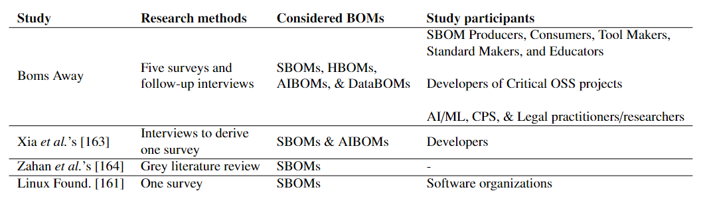
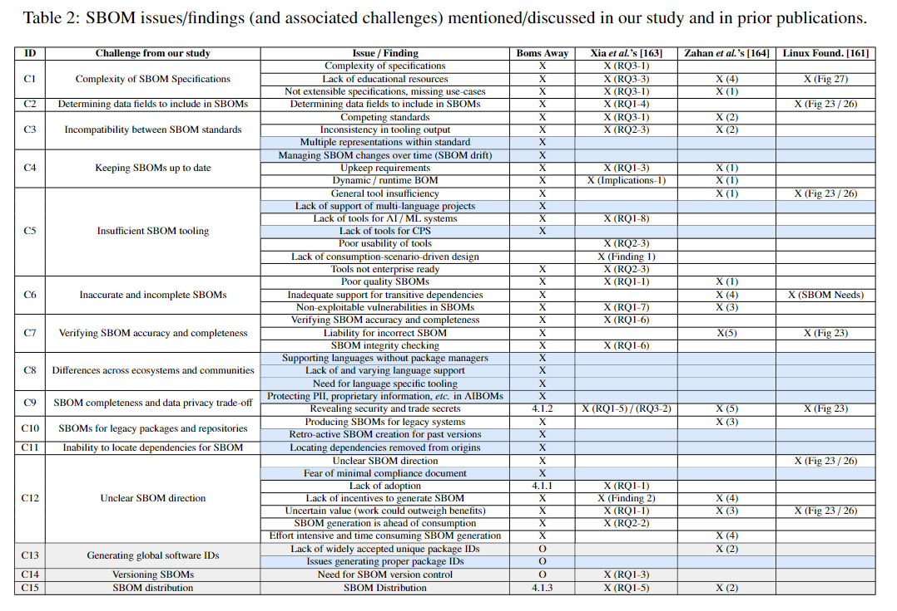

# Data Analysis for SBOM Surveys

All data in this repository has been sanitized and anonymized.

Below describes the ideal structure of this repo, but it is still a work in progress.  Not all folders are available or complete.

## Required Modules
- `pip install pandas`
- `pip install matplotlib`

## Directory Structure

The `survey_questions` folder contains the questions asked in the various surveys administered.

The `codes.json` file lists and defines the codes assigned to the responses to open-ended questions.

The `Interview_Protocol.pdf` file describes the process followed during follow-up interviews with participants.

The `data_analysis` folder contains aggregated survey results and code used to analyze these results.

## Data Analysis

- The `run_all.py` file is the one stop solution to clean, convert, and plot data for all surveys.  Be warned that generating all the plots will take some time.  It could take up to 5 minutes to run this file.

- The `plot.py` file can be run to generate plots for a given survey (this doesn't work with the roles functionality yet).

- The `sanitize.py` file is run to clean the produced JSON and remove any PII before pushing to GitHub.

- The `json_converter.py` file populates the data folder for a survey using the most recent, respective JSON file (located in the `files` directory).

- The `partition.py` file reads and partitions the `response_coding.csv` file by group for a survey.  The result is multiple `response_coding.csv` files each containing only responses from a particular group.

- The `pathmanager.py` file provides an abstraction of the directory structure for the `plot.py` file.

### Survey Results

Within the `data_analysis` folder, there is a parent folder for each of the surveys:
- `initial_survey`
- `key_projects`
- `machine_learning`
- `cyber-physical`
- `legal`

Each parent folder has three nested folders:
- `data`: contains folders with the csv data for responses
- `figs`: contains figures plotting the collected data
- `files`: contains the raw, sanitized JSON files and a file listing valid response IDs

Each parent folder also has a few files:
- `csv2json.py`: converts raw Qualtrics data into a human-readable JSON representation
- `likert.txt`: lists the likert scale questions in the survey
- `questions.json`: A JSON file mapping question IDs to text

## Exploring the Data with the Data Reader

Running the `data_reader.py` file allows the user to explore the data from all surveys in an easy and human readable way through a terminal window.  When the program starts, it will prompt the user for a survey, a question ID, and a participant ID.  Once these are supplied, the user is given more control over how they navigate.

Here is the list of accepted commands:
- surveys: shows the list of available surveys
- questions: shows the list of valid question IDs
- responses: shows the list of valid response IDs
- current: shows the current configuration of the system
- quit: quits the program
- exit: quits the program
- help: shows the help menu
- show \<question ID>: displays question text for that ID
- \<survey>: navigates to the provided survey
- \<question ID>: navigates to the provided question
- \<response ID>: navigates to the provided response
- \<survey> \<question ID> \<response ID>: provides rapid navigation control
- hitting enter: proceeds to the next response, if one is available 

### The Data Folder

The data folder for each survey is further sub-divided into three additional folders:
- `all`: the most useful, contains all response data for questions
- `loose`: provides response data by role (i.e. producer).  Filtering is loose, so a producer + consumer is still considered a producer. 
- `strict`: provides response data by specific role.  Filtering is strict, so a producer + consumer is not considered a consumer.  That is, all combinations of roles are represented in distinct CSV files.

### CSV Files
There are two CSV files at the top level:
- `single`: contains the responses to all single answer questions
- `response_coding`: contains the results of our collective coding process

There are two sub-folders that contain exclusively CSV files:
- `multi_select`: contains a CSV for each multiple select question
- `ranked`: contains a CSV for each rank by preference question

### JSON Converters
Files responsible for the conversion of JSON information into the necessary CSV.  Differences across surveys create a need (at least until more refactoring is possible) to have multiple classes inherit from a common abstract class, where a majority of the logic is held.  Here is the overall structure:
- Folders for each survey
- `__init__.py`: handles import logic
- `abstract_converter.py`: abstract class that contains logic shared by all json to csv converters

This is the structure for a survey folder:
- `__init__.py`: handles import logic
- `config.py`: stores configurations for the conversion
- `*_converter.py`: the instantiation of the abstract class with logic specific to the particular survey

### Response Coding Files
Files used for the analysis of response coding are found in the `response_coding` folder.  These files include:
- `comparer.py` which looks for differences between two sets of codings.  It generates a file `temp.csv` that marks an 'X' where a difference is detected.

# Survey participation requests

| Survey            | Mined | Professional Contact | Total |
|-------------------|-------|----------------------|-------|
| SBOM C&A          | 2253  | 0                    | 2253  |
| Critical Projects | 901   | 0                    | 901   |
| ML                | 1269  | 41                   | 1310  |
| CPS               | 0     | 10                   | 10    |
| Legal             | 0     | 2                    | 2     |
| Total             | 4423  | 53                   | 4476  |

# Full Related Works Comparison

The tables shown here can also be found as PDFs in the `related work` folder.

## SBOM study methodology and scope

 

## SBOM issues/findings coverage by study

| Study          | Discussed Issues/Findings | Coverage | Novel Issues/Findings |
|----------------|---------------------------|----------|-----------------------|
| Boms Away      | 37                        | 88.1%    | 11                    |
| Xia et al.'s   | 23                        | 54.8%    | 3                     |
| Zahan et al.'s | 18                        | 42.9%    | 1                     |
| Linux Found.   | 8                         | 19.1%    | 0                     |
| Total          | 42                        | -        | -                     |

## Comparison  of challenges across papers

# How Solutions Address Challenges

                                                                                                                                                
# Challenge Dependenies

| Contributing Challenge                             | Dependent Challenges                               | Brief justification                                                                                             |
|----------------------------------------------------|----------------------------------------------------|-----------------------------------------------------------------------------------------------------------------|
| (C1) Complexity of SBOM specifications             | (C5) Insufficient SBOM tooling                     | It is difficult to create tools because of the comlexity of the specifications                                  |
|                                                    | (C12) Unclear SBOM direction                       | Complex, hard to understand specs lead to lower adoption and more stakeholder confusion                         |
| (C2) Determining data fields to include in SBOMs   | (C1) Complexity of SBOM specifications             | Increasing the number of fields may improve SBOM quality, but will increase the complexity of the spec          |
|                                                    | (C5) Insufficient SBOM tooling                     | Tools need to know which fields they should support                                                             |
| (C3) Incompatibility between SBOM standards        | (C1) Complexity of SBOM specifications             | Incompatibilities between tools and standards excacerbate the complexity of individual specifications           |
|                                                    | (C5) Insufficient SBOM tooling                     | Incompatibilities between standards pose a challenge to tool creation                                           |
|                                                    | (C12) Unclear SBOM direction                       | Incompatibilities between tools and standards contributes to lower adoption and more stakeholder confusion      |
|                                                    | (C13) Generating global software IDs               | Different standards have different ways of generating or representing global IDs                                |
| (C4)  Keeping SBOMs up to date                     | (C6) Inaccurate and incomplete SBOM                | If an SBOM is not up to date, then the information that it contains in inaccurate                               |
|                                                    | (C14) Managing SBOM versions                       | As the software is updated or changes are made to correct the SBOM, those SBOM versions also require management |
| (C5) Insufficient SBOM tooling                     | (C4) Keeping SBOMs up to date                      | Because sufficient tooling for dynamic or runtime BOMs does not exist, it is difficult to keep BOM up to date   |
|                                                    | (C6) Inaccurate and incomplete SBOM                | Poor tooling produces BOMs of poor quality                                                                      |
|                                                    | (C8) Differences across ecosystems and communities | Differing levels of tooling support can exacerbate differences across ecosystems                                |
| (C6) Inaccurate and incomplete SBOM                | (C5) Insufficient SBOM tooling                     | Consumption tools suffer when the BOMs they consume are inaccurate or incomplete                                |
|                                                    | (C7) Verifying SBOM accuracy and completeness      | If BOMs can be inaccurate or incomplete, it becomes necessary to validate the correctness of BOMs               |
| (C7) Verifying SBOM accuracy and completeness      | -                                                  | -                                                                                                               |
| (C8) Differences across ecosystems and communities | (C5) Insufficient SBOM tooling                     | Some ecosystems provide better resources for tools such as manifest files or package managers                   |
|                                                    | (C11) Inability to locate dependencies for SBOMs   | It is harder to locate dependencies in some language ecosystems                                                 |
| (C9) SBOM completeness and data privacy trade-off  | (C2) Determining data fields to include in SBOMs   | When deciding fields to include, privacy concerns must be considered                                            |
|                                                    | (C6) Inaccurate and incomplete SBOM                | BOMs may be incomplete as a result of protecting private or proprietary information                             |
| (C10) SBOMs for legacy packages and repositories   | (C6) Inaccurate and incomplete SBOM                | Projects that rely on legacy software without BOM are likely to have inaccurate or incomplete BOM               |
| (C11) Inability to locate dependencies for SBOMs   | (C6) Inaccurate and incomplete SBOM                | The inability to locate a project dependency results in an incomplete BOM                                       |
| (C12) Unclear SBOM direction                       | -                                                  | -                                                                                                               |
| (C13) Generating global software IDs               | (C11) Inability to locate dependencies for SBOMs   | One reason developers may be unable to find a software dependency is an ambiguous identifier                    |
| (C14) Managing SBOM versions                       | -                                                  | -                                                                                                               |

# Additional Section Drafts

Here we reproduce draft sections that were omitted from the submitted manuscript due to space limitations.

## Challenges

**(C13) Generating global software IDs.** To make SBOMs actionable,  their dependencies must have globally unique identifiers and name collisions must be handled properly.  One interviewee mentioned: "If you're on the receiving end and trying to make sense, or trying to aggregate and combine the data from this different source, you're going to need some kind of identifier."

When asked about generating globally unique IDs, One standard maker described generating globally unique software IDs as "our hardest problem to solve."

This is further motivated in that 30\% of SBOM practitioners listed software identifiers as a required SBOM field.  For comparison, that is only slightly less than the 32\% that listed dependencies as a must.  For both AI and Data BOMs, 50\% of ML practitioners, mostly unfamiliar with SBOM, selected unique identifiers as must-have fields. 

Due to the dynamic nature of security vulnerabilities, respondents also mentioned that SBOM should link to external vulnerability databases (\eg the CVE) rather than describing vulnerabilities.  Globally unique IDs are essential for this mapping to be effective.

Respondents also mentioned the importance of having an accessible algorithm to transparently generate a software ID instead of using arbitrary IDs. While solutions in different standards exist, they are not yet interoperable.

**(C14) Managing SBOM versions.** SBOMs should have unique version identifiers just like the software that they represent.  These SBOM versions are not inherently tied to changes in the underlying software however, but instead to changes made to the SBOM document itself.  Given that current tooling often misses or inaccurately fills certain fields, it is sometimes necessary to manually and retroactively correct an SBOM.  At this point, there are two SBOMs, nearly identical, that represent the same build.  It becomes crucial to have mechanisms to properly and appropriately maintain and manage these SBOM versions.  One interviewee described the problem: "In theory, you generate a new globally unique ID every time you produce an SBOM.  What I find in practice is most people don't do that. [...]  According to the spec, it's supposed to be absolutely unique.  You change one character in that SBOM, you should change the globally unique ID for that."  Without these globally unique identifiers it can become challenging for clients to determine which version of an SBOM they have on file.

## Solutions

**(S5) Improving documentation.** Our results show that, while documentation and educational resources exist for SBOM, they are not sufficient to address the current complexity of the specifications. One interviewee explained, "It's not just simplicity in the spec. It's not simplicity in the tooling, but how we message it and how we communicate it. Because if we send them to the [standard] spec website, they'll take a look at that and go, well, I'm not going through all that work."

The documentation for specification should be designed with end users in mind.  The number of potential use cases and their associated fields make the specifications daunting (C1).  One interviewee explained that, "[...] if all you care about is security, you know, you can look that up very, very quickly and not be bothered by having to learn all these extraneous things that don't have anything to do with your use case."

Better marketing and more effective communication about SBOMs is required.
Effort needs to be invested in distinguishing  SBOMs from other dependency-tracking systems and quasi-SBOMs, or making it clear how these can technologies can interoperate.  With recent advances in large language models, it is also possible to create a system that provides clear, inter-active, and more user-friendly specifications. Such a system could be used to retrieve facts about a specification on demand and provide SBOM examples for different usage scenarios and contexts. 

 Improved documentation and educational resources is likely to improve SBOM adoption (C12).

 **(S6) Techniques for generating software IDs.** There are two possible solutions to this problem (C13). First, Registration systems have the benefit of allowing the inclusion of additional information, but as one expert said, “I think the problem with the more registration oriented IDs is it's just not getting adopted. Or it's getting adopted in the ways that are [like] the CPEs, you know, you'll find five CPEs for the exact same software, and that can be a little confusing." 

Then, there are the machine-generated IDs.  Based on the NTIA's document on SBOM versions and our expert interviews, we have identified the five most common software identity formats.  These are:  Concise SWID Tags (CoSWID), Common Platform Enumeration (CPE), Package-URLs (purl), SoftWare Heritage persistent IDentifiers (SWHID), and GitOIDs.

One interviewee discusses purl as a solution, “But it [package url] helps a lot to have a seamless way to identify a package just by observing the code, in most cases. And once you have that, it becomes easy to relate that to a security database, a dependency tree, or anything else."

As is the case with SBOM, it is unlikely that a single software identification standard will emerge or win out over the others.  Instead, we must live in a world where all the standards can successfully and harmoniously coexist. 